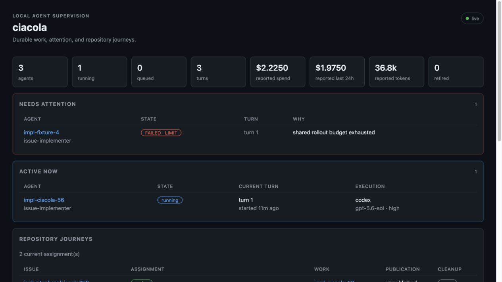

# Ciacola

Ciacola is a local agent server for durable, resumable software work. It keeps
provider conversations, turns, repository assignments, costs, limits, and
recovery state in one SQLite ledger, then exposes them through MCP and a live
operator board.

Use it when agent work should survive a server restart, stay attributable to a
role and repository issue, and stop safely instead of being silently retried.

> **Status: early and supervised.** Claude and Codex have both completed real,
> reviewed repository work through Ciacola. The core workflow is usable for
> dogfood, but configuration and public interfaces can still change. Ciacola is
> a single-operator local product, not a multi-tenant security boundary.



## What it does

- Treats an agent as a durable provider conversation, not a disposable job.
- Writes every turn before dispatch and resumes provider state after restart.
- Keeps queued work closed until configuration, plugins, HTTP, and recovery are
  ready.
- Runs Claude and Codex behind one capability-aware provider contract.
- Applies rolling admission breakers and provider-native per-turn ceilings.
- Gives each agent an authenticated, least-authority MCP scope.
- Tracks an issue from assignment through worktree, branch, pull request, and
  cleanup.
- Shows attention, active work, execution context, repository journeys, usage,
  and health on a live, responsive board.
- Lets plugins contribute tools, roles, board sections, health, routes, and
  retention without privileged side paths.

The core operator tools are deliberately small:

```text
spawn   define an agent; runs nothing and costs nothing
send    add a durable turn and return immediately
wait    wait for one turn to settle
get     inspect one agent and its conversation
list    inspect every active agent and its lineage
kill    stop a running turn without deleting the agent
```

## Supported today

<!-- markdownlint-disable MD013 -->

| Capability | Claude | Codex |
| --- | --- | --- |
| Authentication | Authenticated Claude home or Unix startup token descriptor | Authenticated Codex home or Unix startup token descriptor |
| Resume identity | Claude session id | Codex thread id |
| Usage | Reported input, output, cache, and USD cost when the CLI supplies them | Reported input, output, and cache; no Ciacola price table |
| Per-turn ceiling | Integer micro-USD, checked at provider-response boundaries | Versioned native rollout units for tested CLI versions, checked at provider-response boundaries |
| Provider tools | Named Claude tool allowlist | Native Codex policy; named Claude-style grants are refused |
| Containment | Hermetic provider settings; Claude does not claim an OS sandbox | `read-only`, `workspace-write`, or `workspace-write-no-network` |
| Scoped Ciacola MCP | Yes, on opening and resume | Yes, on opening and resume |
| Known gap | Budget enforcement can overshoot through in-flight work | Budget terminal JSON can omit usage; unsupported CLI versions fail closed for configured ceilings |

<!-- markdownlint-enable MD013 -->

Provider capabilities are explicit rather than reduced to a fictional common
denominator. See [Configuration](docs/configuration.md#providers) for the full
matrix and versioned ceiling semantics.

## Quickstart

### Prerequisites

- Git and a current stable Rust toolchain.
- One provider CLI: [Claude Code](https://code.claude.com/docs)
  or [Codex CLI](https://github.com/openai/codex), already authenticated.
- `gh auth login` for repository and pull-request work.
- [`mcp-repl`](https://github.com/joshrotenberg/mcp-repl) for the interactive
  operator workflow.

Ciacola is currently installed from source. Its four wrapper dependencies are
pinned Git revisions, so use the checked-in lockfile:

```sh
git clone https://github.com/joshrotenberg/ciacola.git
cd ciacola
cargo build --locked -p ciacola
cargo install --locked mcp-repl
```

Create `ciacola.toml`. This safe starting point uses the shipped Claude issue
implementer. Replace `OWNER/REPO` with a repository your authenticated `gh`
client can read and write:

```toml
[runtime]
hermetic = "full"

[limits]
daily_warn_usd = 5.0
daily_stop_usd = 10.0
max_spawn_depth = 3

[limits.providers.claude]
# $2.00 in integer micro-USD. Enforcement is response-boundary, not exact.
per_turn_ceiling = 2_000_000

[plugins.repo-worker]
root = "~/.local/share/ciacola/repos"
repos = ["OWNER/REPO"]
```

Start Ciacola as an interactive stdio MCP server:

```sh
mcp-repl -- ./target/debug/ciacola
```

The startup banner prints the resolved ledger, providers, limits, roles,
plugins, recovery result, and dispatch state. Open
[http://127.0.0.1:4823/board](http://127.0.0.1:4823/board) while the REPL stays
running.

An absent `ciacola.toml` is valid and starts an empty server. The annotated
[`ciacola.example.toml`](ciacola.example.toml) shows every supported section.

## First issue to draft PR

Inside `mcp-repl`, start one allowlisted issue:

```text
start_issue repo=OWNER/REPO issue=123
```

The result contains a durable assignment and an implementer `agent_id`. Send
the task once, then wait for that returned turn sequence:

```text
send agent_id=AGENT_ID text="Implement the issue, verify the full gate, and commit."
call wait agent_id=AGENT_ID seq=1 timeout_secs=600
```

`call wait` is intentional because `wait` is also an mcp-repl task command.
If `start_issue` returns `created=false`, reuse the existing assignment and do
not send the implementation prompt again.

Read the worker reply, inspect the diff and commit yourself, and run the
repository's gate. Publication is a separate human action. Push exactly the
reviewed full commit OID and open a draft PR:

<!-- markdownlint-disable MD013 -->

```text
open_pr agent_id=AGENT_ID expected_head=FULL_COMMIT_OID title="fix: describe the change" body="Closes #123" draft=true
```

<!-- markdownlint-enable MD013 -->

After the PR is merged, reconcile and remove the managed worktree:

```text
finish_issue agent_id=AGENT_ID keep=false
```

Cleanup refuses dirty work, unpublished commits, open or closed-unmerged PRs,
and moved heads unless the operator supplies the exact explicit discard fence.
See [Operations](docs/operations.md#repository-journeys) before recovering a
stale assignment or discarding work.

## Operating Ciacola

- The board is the normal supervision surface. MCP remains the power and
  control interface.
- `Ctrl-C` stops HTTP intake and drains in-flight turns for up to ten minutes.
  A second `Ctrl-C` abandons them for restart recovery.
- The ledger defaults to `$XDG_DATA_HOME/ciacola/ciacola.db`, or
  `$HOME/.local/share/ciacola/ciacola.db`. `CIACOLA_DB` overrides it.
- Rolling daily stops decide whether a new turn may be admitted. They are not
  reservations: admitted and concurrent turns can finish beyond them.
- Per-turn ceilings use provider-native units and response-boundary checks, so
  they also can overshoot through work already in flight.
- Nothing prunes automatically. The operator-only `prune` tool blanks old turn
  text while retaining state, cost, usage, and timing.

Read [Operations](docs/operations.md) for startup, backup, recovery, limits,
logs, pruning, and troubleshooting.

## Security model

Ciacola listens only on loopback. Human stdio is the simplest trusted operator
surface. Optional HTTP operator access uses a root bearer read from an inherited
descriptor; the ordinary `/mcp` mount accepts only server-issued credentials
for active agents. Provider-backed operator roles and delegated supervisor
authority remain disabled.

Provider children start from a cleared environment with a small baseline and
exact configured passthrough names. This is direct-child credential hygiene,
not isolation from another hostile process running as the same OS user. Use a
separate account, VM, or container when workloads must distrust one another.

Read [Security](docs/security.md) before enabling HTTP operator access,
environment passthrough, schedules, webhooks, or unattended repository work.

## How it fits together

An agent exists while no process is running. A turn is one provider execution
against that durable conversation. Ciacola records the turn first; the provider
owns its session or thread; the ledger owns authority, admission, attribution,
telemetry, and recovery. Recovery resumes known provider state and never
pretends a repeated paid call is the same work.

In-tree plugins use the same public plugin contract as external code. The
repository worker is one plugin, not a second orchestration runtime.

See [Architecture](docs/architecture.md) for the durable-conversation thesis,
component boundaries, surfaces, and plugin model. Contributors should also
read [CONTRIBUTING.md](CONTRIBUTING.md). Historical design evidence remains in
[HANDOFF.md](HANDOFF.md), but it is not the operating manual.

## Documentation

- [Configuration reference](docs/configuration.md)
- [Operations and recovery](docs/operations.md)
- [Security boundaries](docs/security.md)
- [Architecture](docs/architecture.md)
- [Delegated supervision ADR](docs/adr/0001-process-isolated-delegated-supervision.md)
- [Annotated example configuration](ciacola.example.toml)
- [Contributing](CONTRIBUTING.md)

Behavior-changing pull requests should update the relevant product document in
the same change. Commands in the quickstart and operations guide are tested
against the current source tree before release.

## Evidence and limitations

Ciacola has produced reviewed, merged work in its own backlog, `redis-tower`,
`claude-wrapper`, and a private deterministic workflow fixture. Dogfood has
covered provider resume across server restarts, exact-head PR publication,
idempotent cleanup, native turn limits, interrupted telemetry, and fail-closed
recovery.

It is still pre-release. There is no packaged binary, stable public API,
multi-user authorization model, secure provider-backed supervisor channel, or
claim that provider tools are an OS sandbox. Follow the live
[roadmap](https://github.com/joshrotenberg/ciacola/issues/59) and report
dogfood failures as focused issues with reproducible evidence.

## License

Licensed under either [MIT](LICENSE-MIT) or [Apache-2.0](LICENSE-APACHE), at
your option.
