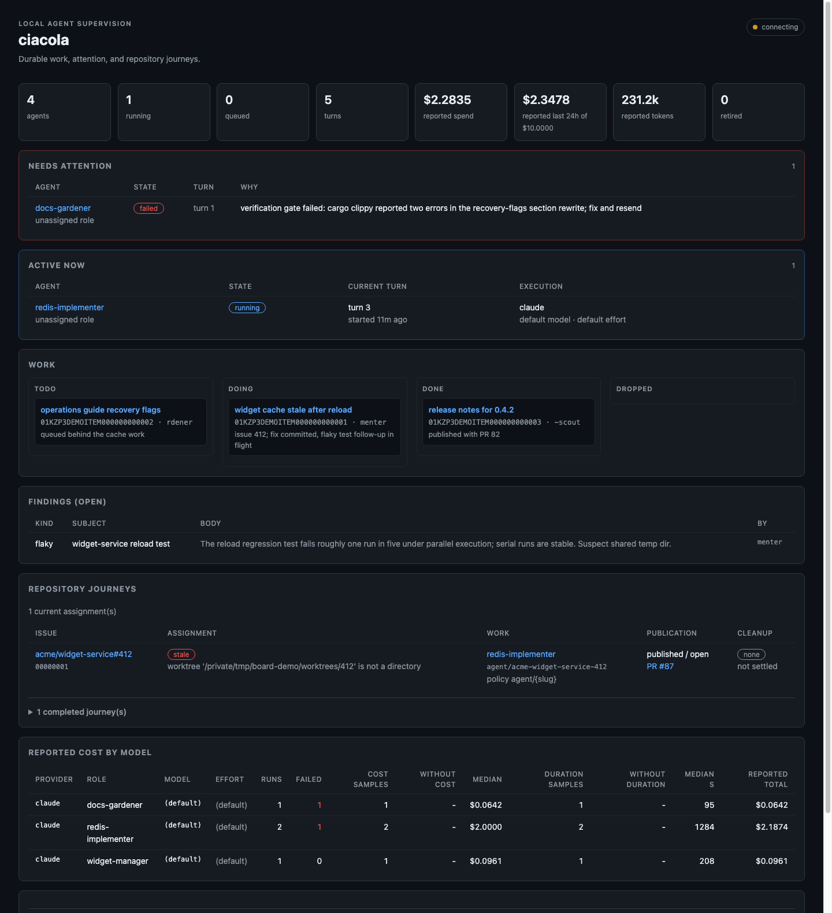
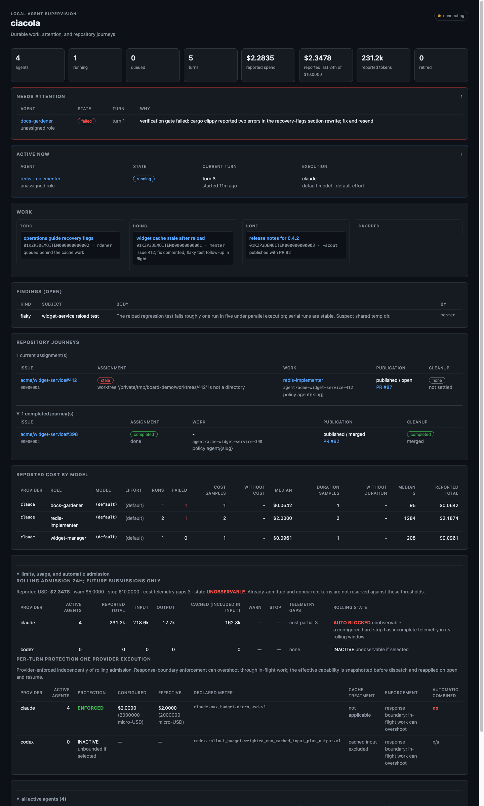
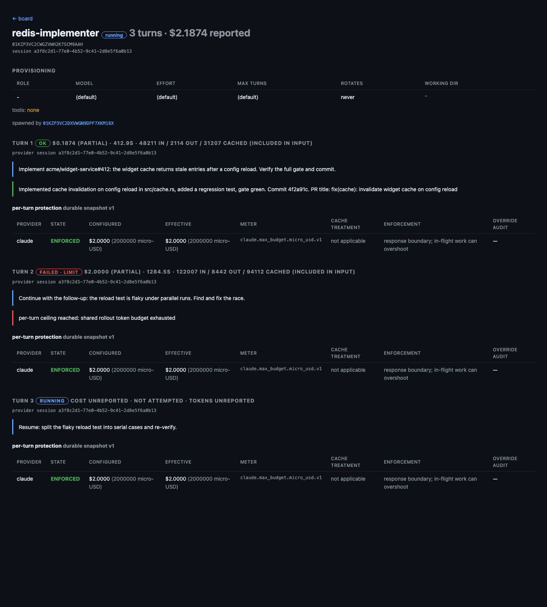
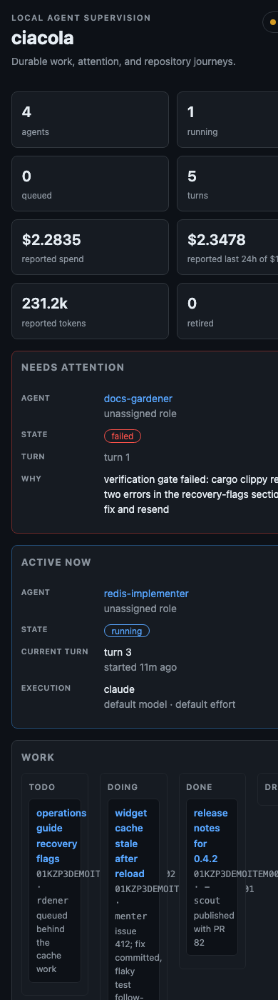

# Board design brief

A handoff document for a UI design session on the Ciacola board. It states
what the board is, what data and actions the server can supply, the
constraints a redesign must respect, and the open questions a design should
answer. Everything here is current against the source tree as of 2026-08-10;
the screenshots come from a seeded demonstration ledger, not live dogfood.

## The product in one paragraph

Ciacola runs coding agents as durable provider conversations. An agent
exists while nothing is running; a turn is one paid provider execution
against it. The SQLite ledger owns admission, attribution, telemetry, and
recovery. The board is the operator's watching surface: MCP (stdio or
authenticated HTTP) is the doing surface. That split was decided, not
defaulted into: the board should get much better at watching before it
acquires actions, and any action it does acquire is a carefully authorized
coarse intervention, not a second orchestration UI.

## What the board is today

Server-rendered HTML from the `ciacola-board` crate, no build step, no
client framework. Roughly 30 lines of vanilla JS hold an SSE connection to
`/board/events`; the server re-renders the overview every two seconds,
hashes it, and emits an event when the hash changes; the client fetches
`/board/fragment` and swaps it in, preserving open disclosures (by stable
id) and focus. Detail pages are deliberate point-in-time snapshots without
liveness.

The overview is exception-first, in order:

1. Stat row: agents, running, queued, turns, reported spend, rolling 24h
   spend against the configured stop, reported tokens, retired count.
2. Needs attention: agents whose latest turn failed or was killed, with the
   failure reason.
3. Active now: queued and running turns with provider, model, effort, and
   started-ago.
4. Plugin sections: kanban lanes, repository journeys, findings, schedules,
   references, git state, tuning, webhook hooks.
5. Disclosures, closed by default: limits/usage/admission detail, and the
   full agent catalog.

The agent page is currently a full transcript dump, oldest first: every
turn's prompt, reply, error, usage, and durable per-turn protection
snapshot. It is honest and complete, and it does not scale past a handful
of turns; redesigning it is an open item below.

Tables transform to labeled cards at narrow widths; captions are
screen-reader-only; the live status dot has an `aria-live` label.

## Data the server can answer with

Everything below is durable in the ledger or derivable live; nothing
requires a provider call.

- **Agents**: id, name, role provenance, provider/model/effort, session id,
  spawned-by lineage, retirement, accumulated reported cost, turn count,
  last activity.
- **Turns**: prompt, state (queued, running, ok, failed, killed), reply,
  error, failure kind (including `limit`), elapsed, claimed/settled times,
  provider session, tokens in/out/cached, cost with honesty labels
  (reported, partial, unreported, unpriced, legacy), and the versioned
  per-turn protection snapshot (configured ceiling, meter, enforcement
  granularity, cache treatment, override audit).
- **Admission**: rolling 24h USD and provider-token windows against
  configured warn/stop values, and whether admission is currently open.
- **Repository journeys** (repo-worker): assignment state machine
  (preparing, active, finishing, retained, completed, stale), phase,
  branch, worktree, PR number/url/state/draft, exact pushed and expected
  heads, cleanup state and reason, timestamps.
- **Kanban**: items in lanes with owner, note, and per-item event history.
- **Findings**: kind, subject, body, author, status, resolution.
- **Schedules**: interval, next fire, fire/skip counts.
- **References**: tagged pointers saved by operator or agents.
- **Git state** (stateless plugin): live branch, head, dirty files,
  ahead/behind for any agent workdir.
- **Health**: row counts, database size, longest-running sessions, plus
  per-plugin health JSON (repo-worker reports durable/physical drift).
- **Model stats** (tuning): runs, failures, median cost and duration by
  role, model, and effort.

## The action surface (MCP, operator only)

The board itself is read-only. The operator MCP surface exposes 34 tools;
the ones a supervision UI would plausibly surface as coarse actions are
marked with (+). Destructive or high-authority verbs stay behind the
operator credential regardless of surface.

| Group | Tools |
|---|---|
| Core verbs | spawn, spawn_role, send, resend, wait, get, list, kill (+), retire (+) |
| Supervised overrides | send_supervised, resend_supervised |
| Repository work | start_issue, open_pr (+), finish_issue (+), worktrees, repo_state |
| Work tracking | track, items |
| Findings | file_finding, findings, resolve_finding (+) |
| Schedules | schedule, schedules, unschedule (+) |
| Memory and refs | remember, recall, save_ref, refs, forget_ref |
| Meta | roles, health, model_stats, hooks, prune |

Sessions against the server also get `completion/complete` answers from the
ledger (agent ids, etc.) and an `instructions` front door, so a generic MCP
client is first-class. Any UI action design should reuse these verbs
rather than invent a parallel HTTP API: the MCP surface is the contract.

## HTTP surface

| Route | What |
|---|---|
| `/board` | the overview page |
| `/board/agent/{id}` | agent detail snapshot |
| `/board/fragment` | overview body for the live swap |
| `/board/events` | SSE; emits a version event when the overview changes |
| `/board/item/{id}` | kanban item detail (plugin-owned route) |
| `/webhook/...` | inbound pokes (plugin-owned) |
| `/mcp` | agents' own MCP mount; server-issued per-agent credential required |
| `/mcp-operator` | human MCP mount; root bearer via inherited descriptor |

Everything listens on loopback only.

## Plugin contribution contract

A plugin can contribute `board_section() -> Option<Section>` where
`Section` is `{title: String, html: String}`, rendered inside a uniform
panel shell without parsing, and `routes() -> Option<Router>` for its own
pages. Eight plugins use these today. The contract's known limits, which a
redesign may push on additively (new optional trait methods, never breaking
the blob form): sections cannot contribute typed attention items or journey
rows the overview could rank and filter, cannot declare placement or
priority, and cannot version themselves for per-panel refresh.

## Constraints a design must respect

- **No build step.** `cargo run` and the board exists. No npm, no bundler,
  no asset pipeline. Inline CSS and vanilla JS (or htmx-style server
  fragments) are the budget. This is a deliberately protected property.
- **The state is server-side.** The ledger is the state; the board owns no
  client state worth a framework. Liveness is server-rendered fragments
  over SSE, and per-panel fragments are the sanctioned growth path.
- **Honest telemetry is a feature.** The cost/usage labels (partial,
  unreported, unpriced, measured) and the admission-vs-protection
  distinction exist because pretending precision caused real
  overspending. A design must not average, round away, or hide these
  states to look cleaner.
- **Exception-first ordering.** Attention, then active work, then
  inventory. The default view is for the operator who has been away for
  hours and needs to know what wants them.
- **Read-only until authorization is designed.** Board actions require the
  operator credential path; nothing on the board may widen agent
  authority. Delegated supervisor authority is deliberately disabled
  pending an isolation backend decision (issue #81, ADR 0001).
- **Accessibility floor already set**: responsive card tables, sr-only
  captions, aria-live status, keyboard-reachable disclosures that survive
  refreshes.

## Open questions for the design session

1. **The agent page.** The transcript dump needs an information
   architecture: turn index, collapsed turn cards, latest-first, and the
   protection snapshot demoted to a disclosure. What does a 40-turn
   conversation look like?
2. **Changed since last look.** Multi-day supervision needs a durable
   cursor ("what happened while I was away"), which implies an event feed
   the ledger does not persist yet. What would the operator want the
   morning after?
3. **Operator input.** If the board gains actions, which of the (+) verbs
   above earn a button, what confirmation does each need (kill a paid
   running turn vs resolve a finding are different weights), and how is
   the operator credential presented to the board? One candidate shape:
   the board stays read-only and deep-links into an MCP client; another:
   authenticated POST routes wrapping exactly the MCP verbs.
4. **Journeys as pages.** Repository journeys render as a table row today;
   an issue-to-merged-PR journey has enough state for a timeline page.
   Same question for schedules and findings.
5. **Spend over time.** The ledger has per-turn settled cost and
   timestamps; nothing renders trend. Where does that live without
   becoming a dashboard product?
6. **Per-panel liveness.** When panels refresh independently (per-panel
   version hashes or htmx), what visual grammar says "this panel just
   changed" without being noise?

## Pointers

- Issue #56 carries the design history and the merged first slice (#100).
- `HANDOFF.md`, "The board, properly" section, for the toolkit reasoning.
- `docs/architecture.md` for component boundaries; `docs/security.md` for
  the authorization model any input design must fit.
- The demo ledger behind these screenshots: four spawned agents, seeded
  turns in every telemetry state, one active and one completed repository
  journey. No provider was invoked.
